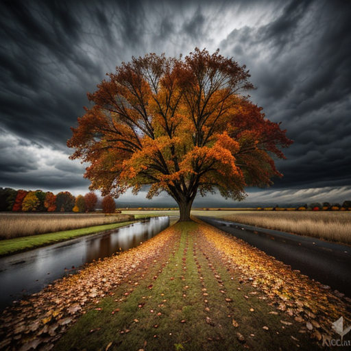

# IA-generativa-imagenes
Implementación de modelo pre-entrenado para generación de imágenes.

## DESCRIPCIÓN
Se usó python con algunas librerías para usar un modelo preentrenado para la generación de imágenes a peticion de un prompt.

Para hacer uso de este proyecto es necesario descargar el modelo realistic vision de la pagina que se muestra en el siguiente apartado.

## 📜 Atribución
Este proyecto utiliza un modelo de inteligencia artificial desarrollado por Stability AI.

Modelo: [realisticVisionV60B1_v51HyperVAE](https://civitai.com/models/4201/realistic-vision-v60-b1)

Fuente: CivitAI

Licencia: CreativeML Open RAIL++-M License

## ⚠️ Notas sobre la licencia
El uso de este modelo está sujeto a los términos de la CreativeML Open RAIL++-M License. Se prohíbe su uso en actividades que violen las restricciones establecidas en la licencia.

Si se han realizado modificaciones en el modelo, estas no implican el respaldo de Stability AI ni de los creadores originales.

## Imagenes generadas por el proyecto

### 1

### 2
